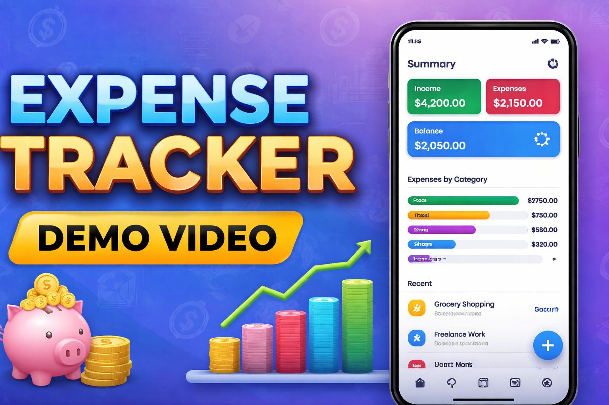

# Expense Tracker

## Project Overview

Expense Tracker is a modern Android application built using **Jetpack Compose** and **Firebase** that helps users track income and expenses, organize spending by categories, and visualize expense distribution with charts.

The app demonstrates **clean architecture (MVVM)**, **Firebase Authentication**, **Firestore real-time persistence**, and **Material Design 3 UI**.

Anish Ummenthala - 866515844

---

## Tech Stack

- **Language:** Kotlin
- **UI:** Jetpack Compose (Material Design 3)
- **Architecture:** MVVM + Repository Pattern
- **State Management:** StateFlow + ViewModel
- **Async:** Kotlin Coroutines
- **Authentication:** Firebase Authentication (Email/Password)
- **Database:** Cloud Firestore (real-time sync)
- **Navigation:** Navigation Compose

---

## Features (Mapped to Rubric)

---

### 1. Authentication (Firebase – Email/Password)

- User Sign Up and Login
- Email format validation
- Password validation (minimum 6 characters)
- Loading states during authentication
- User-friendly error messages
- Persistent login (user remains logged in after app restart)
- Protected navigation (authenticated vs non-authenticated screens)
- Sign out functionality

---

### 2. Data Persistence (Firestore)

Two main entities with **full CRUD**:

#### Categories

- Create, Read, Update, Delete categories
- Each category has a **custom color**
- Color picker UI when creating/editing categories

#### Transactions

- Create, Read, Update, Delete transactions
- Fields include amount, type (income/expense), category, note, and date
- Category selection enforced (cannot save without category)
- Date picker for transaction date

#### Firestore Requirements

- User-specific data isolation (`users/{uid}/...`)
- Real-time updates using snapshot listeners
- Query operations:
  - Filter by type
  - Filter by category
  - Search by note
  - Sort by date
  - Filter by date range
- Composite indexes configured for filtered + sorted queries

---

### 3. UI Implementation (Jetpack Compose)

**8 Functional Screens**

1. Login Screen
2. Sign Up Screen
3. Dashboard
4. Transactions List
5. Transaction Detail
6. Add/Edit Transaction
7. Categories Management
8. Profile / Settings

**UI Features**

- Material Design 3 components
- Consistent theming
- Top app bars with back navigation
- Floating Action Buttons
- Loading indicators
- Error states with messages
- Empty states with helpful text
- Confirmation dialogs for destructive actions
- Dropdowns and date pickers
- Color-coded categories

---

### 4. Dashboard Features

- Three summary cards:
  - Total Income
  - Total Expenses
  - Balance
- Recent transactions list
- **Expenses by Category chart**:
  - Horizontal bar chart
  - Uses category colors
  - Shows top expense categories

---

### 5. Architecture & Code Quality

- MVVM architecture with strict separation of concerns
- Repository pattern for data access
- ViewModels manage all business logic
- UI layer is stateless and reactive
- StateFlow used for UI state
- Coroutines with proper scopes
- Clean, readable, well-organized code
- No critical issues or anti-patterns

---

### 6. Extra Mile Features

- Category color picker with palette + hex input
- Category color dot shown on transactions
- Expense chart by category
- Date picker for transactions
- Date range filtering
- Reusable UI components (StatCard, TransactionRow, AppTopBar, FAB)

---

## Firestore Security Rules

```js
rules_version = '2';
service cloud.firestore {
  match /databases/{database}/documents {
    match /users/{userId}/{document=**} {
      allow read, write: if request.auth != null && request.auth.uid == userId;
    }
  }
}
```

---

## Project Setup Guide

1. Clone the repository:

```bash
git clone https://github.com/cpsc-411a-expense-tracker.git
```

2. Open the project in **Android Studio**

3. Create a Firebase project:

   - Enable **Email/Password Authentication**
   - Enable **Cloud Firestore**

4. Add Android app in Firebase:

   - Package name: `com.uanish.expensetracker`

5. Download `google-services.json` and place it in:

```
app/google-services.json
```

6. Build and run the app

---

## Firestore Indexes

Composite indexes were created for:

- Type + Date sorting
- Category + Date sorting
- Type + Category + Date sorting
  (All using **collection group: `transactions`**)

---

## Screenshots

### Dashboard Screen

<p align="center">
 
</p>

### Transaction List Screen

<p align="center">
 
</p>

### Add Transaction Screen

<p align="center">
 
</p>

### Edit Transaction Screen

<p align="center">
 
</p>

### Transaction Detail Screen

<p align="center">
 
</p>

### Category List Screen

<p align="center">
 
</p>

### Add Category Screen

<p align="center">
 
</p>

### Edit Category Screen

<p align="center">
 
</p>

### Login Screen

<p align="center">
 
</p>

### Sign Up Screen

<p align="center">
 
</p>

---

## Demo Video

[](https://youtu.be/KdIYxMcWRqo)

Click the link to watch the app in action.

- Demo includes:
  - Authentication flow
  - Persistent login
  - CRUD for categories and transactions
  - Filters, sorting, and date range
  - Dashboard and expense chart
  - Real-time updates
  - Sign out
